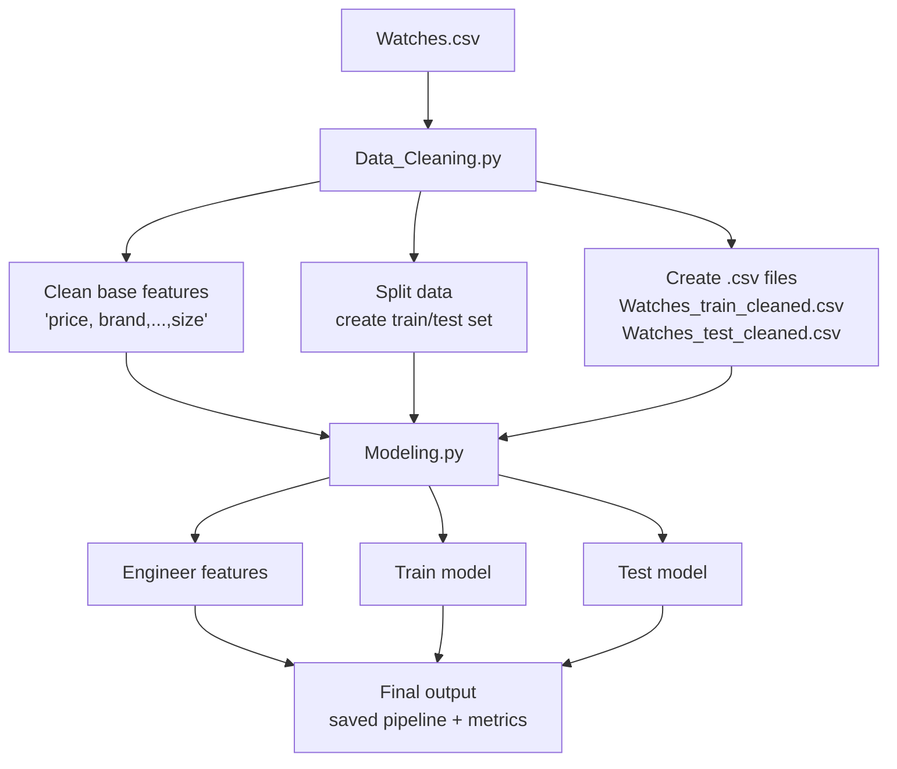
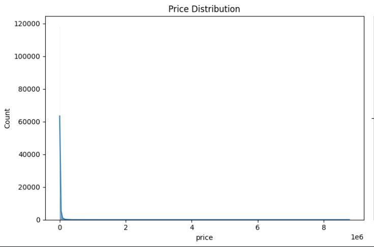
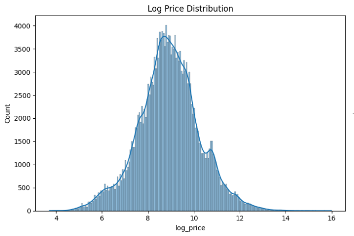
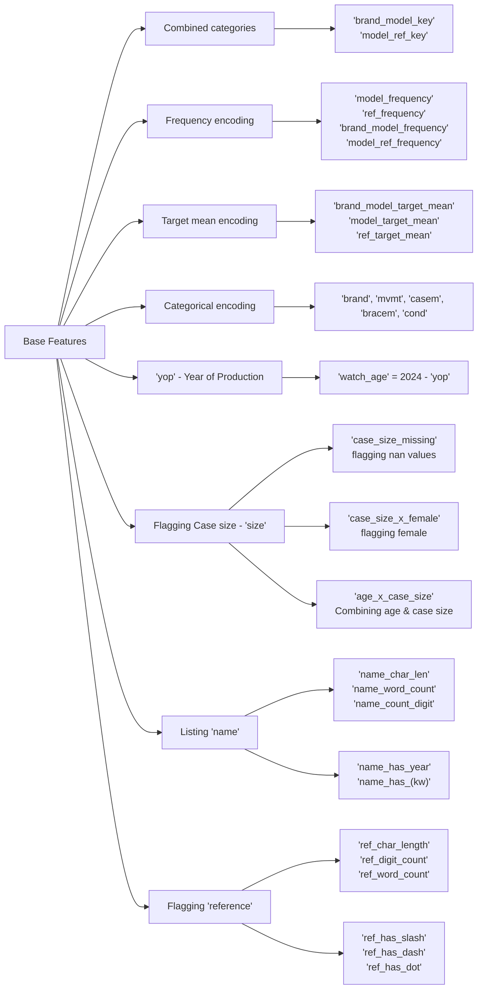
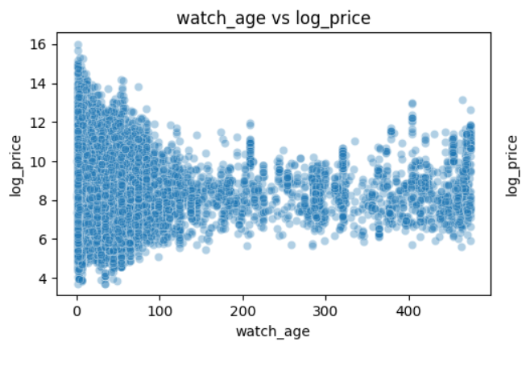
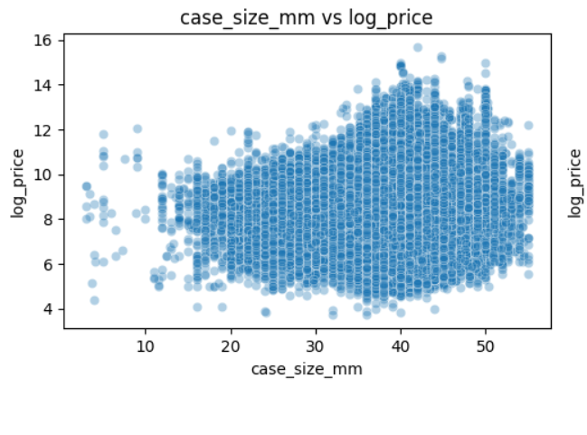
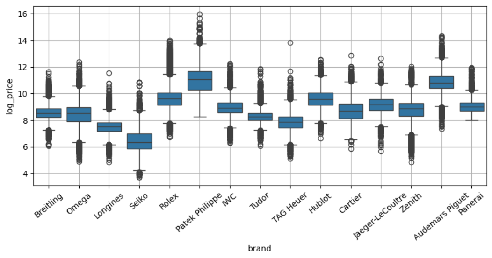
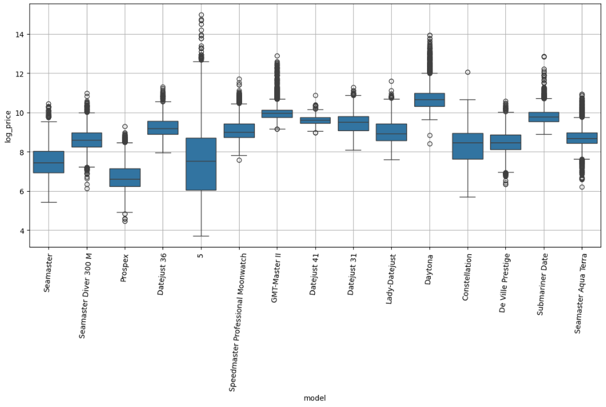

# Watch Price Prediction Pipeline 

## Overview

### Performance
This project builds a simple end-to-end Machine Learning pipeline for predicting watch prices. It prepares cleaned train and test sets, then loads/trains a fine-tuned Extra Trees regression pipeline. The final model achieves a reasonable performance on the test set: 

| Metric | Result | Meaning |
| :--- | ---: | :--- |
| R2 on log price | 0.942 | Explains about 94% of price variation. |
| MAE in dollars | $4,395 | Average dollar error. |
| MAPE | 22.1% | Predictions are off by about 22% on average. |

### Project Structure 
```text
Watch Price Pipeline
|
|-- Main Pipeline
|   |-- main.py
|   |-- Data_Cleaning.py
|   |-- Modeling.py
|
|-- Notebooks
|   |-- Cleaning_Experiment.ipynb  - Cleaning approach experiments
|   |-- EDA.ipynb                  - Exploratory data analysis
|   |-- Linear_Modeling.ipynb      - Linear model experiments
|   |-- Tree_Modeling.ipynb        - Non-linear model experiments
```

## Pipeline flow



## Input data
The project uses the input data from Kaggle dataset [Luxury Watch Listings](https://www.kaggle.com/datasets/philmorekoung11/luxury-watch-listings). The dataset requires significant preprocessing (cleaning & fitting) because many important fields has a great portion of missing values. Price - target value is highly skewed. The median watch price is about `$19k`, while the most expensive price is
about `$9M`


| Feature | Description | # of Missing values| % of Missing values |
| :--- | :--- | ---: | ---: |
| `name` | Full listing title, e.g. `Rolex Submariner Date`. | 72,585 | 25.51% |
| `price` | Listed watch price. | 406 | 0.14% |
| `brand` | Watch manufacturer, e.g. `Rolex`. | 131 | 0.05% |
| `model` | Watch model or collection, e.g. `Submariner`. | 30,466 | 10.71% |
| `ref` | Reference number, e.g. `126610LN`. | 43,152 | 15.17% |
| `yop` | Year of production, e.g. `2021`. | 134 | 0.05% |
| `mvmt` | Movement type, e.g. `Automatic`. | 196,685 | 69.14% |
| `casem` | Case material, e.g. `Steel`. | 164,271 | 57.74% |
| `bracem` | Bracelet material, e.g. `Steel`. | 174,896 | 61.48% |
| `cond` | Watch condition, e.g. `Very good`. | 75,987 | 26.71% |
| `size` | Case size text, e.g. `40 mm`. | 23,597 | 8.29% |
| `sex` | Intended gender category, e.g. `Men's watch/Unisex`. | 95,805 | 33.68% |
| `condition` | Original condition field. | 212,922 | 74.84% |

## Modeling

`Modeling.py`  uses the cleaned train and test sets created from `Data_Cleaning.py`. The target variable, `price` is log-transformed before training to reduct the impact of extreme outliers. The final model is a fine-tuned Extra Trees Regressor wrapped in a scikit-learn pipeline. This helps handle feature engineering, encoding, training, evaluation, and model saving.

### Why Log-Transformed ? 

Log Transformation make the signal of the `price` feature much more vivid. See the notebook `EDA.ipynb` for more details.

<p align = 'center'>
  
  
</p>
    
### Feature Engineering

The engineered features is created as below. View  the notebook `Tree_Modeling.ipynb` for the detailed process.



## Explonatory Data Analysis

`watch_age` and `case_size_mm` do not have a direct relationship with `log_price`. Many watches with different year of production and case size still have the same size:

<p align='center'>
  
  
</p>

Brand and Models are the strong features driving the price:

<p align='center'>
  
  
</p>

Detailed Analysis is described in the notebook `EDA.ipynb`

## Model Selection
### Linear Models (See `Linear_Modeling.ipynb` for more details)
Ridge Regression was used as the linear baseline because it is stable with many encoded features and uses L2 regularization to reduce overfitting.

| Model | RMSE log | MAE dollars | RMSE dollars | R² log |
| :--- | ---: | ---: | ---: | ---: |
| Ridge | 0.363 | $5,326 | $66,540 | 0.925 |
| Linear SVR | 0.371 | $5,125 | $66,912 | 0.922 |
| ElasticNet | 0.393 | $5,988 | $68,471 | 0.913 |
| SGD Huber | 0.587 | $9,124 | $75,476 | 0.805 |

### Non-Linear Models (See more details in `Tree_Modeling.ipynb`)
HistGradientBoostingRegressor was used as the first non-linear baseline because it can learn feature interactions such as brand × model, condition × model, and material × brand.

|Model |RMSE log |MAE dollars |RMSE dollars |R² log|
|:--- |---: |---: |---: |---:|
|Extra Trees |0.326 |$4,694 |$67,125 |0.940 |
|Random Forest |0.341 |$5,184 |$66,520 |0.934 |
|Hist Gradient Boosting |0.365 |$6,123 |$65,500 |0.924 |